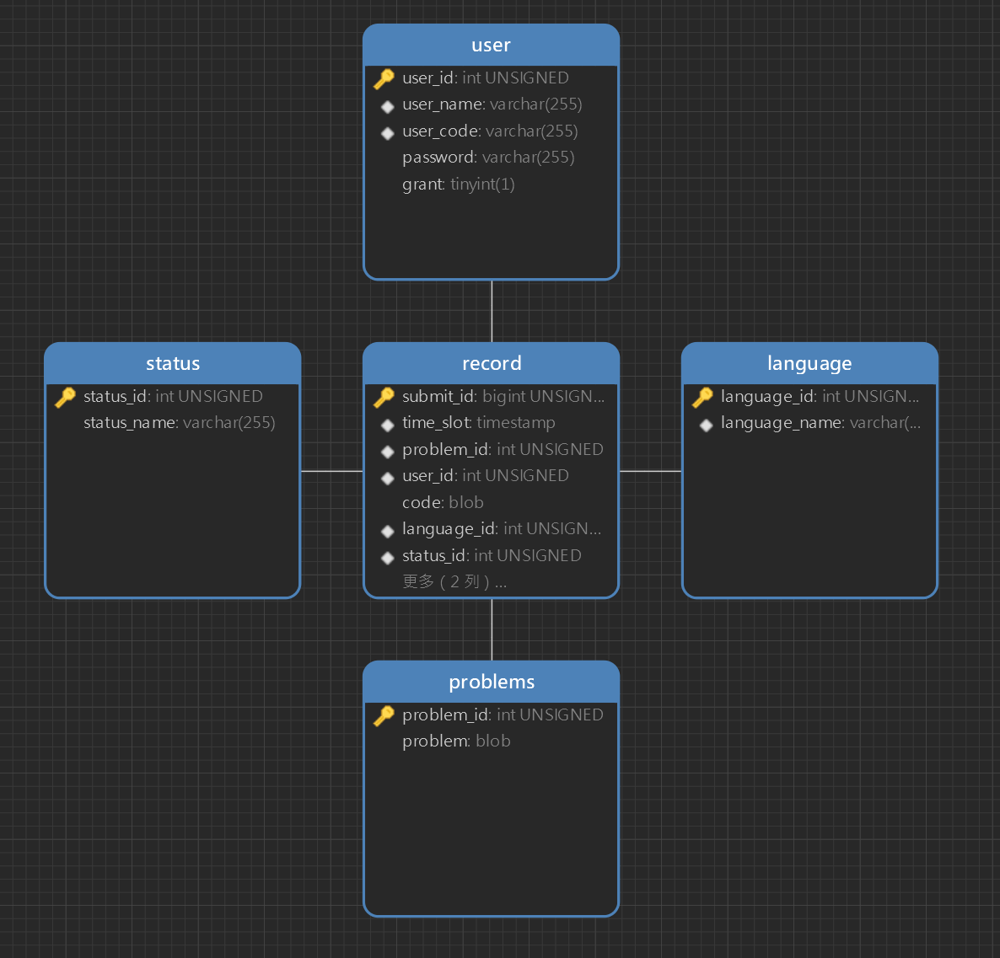

## 数据库设计


使用外键约束。

对记录的过滤功能的支持中，过滤要求基本没有对某一列进行范围获取的要求，而常常是直接对特定的内容匹配，故基本使用哈希索引。

## 功能设计和开发
### 未启用功能
后端实现了功能较为丰富的查询筛选功能。

```python
# 按要求选择提交记录，返回成功与否
# 传入参数为空，则表示不做限制
def select_record(self,
        submit_ids:list[int] = [],
        user_ids:list[int] = [],
        status_ids:list[int] = [],
        problem_ids:list[int] = [],
        language_ids:list[int] = []
        )->bool:
    pass
```

后端支持多记录修改与删除

```python
def update(self,
          update_column:str,
          update_record:list[(any,int)])->bool:
    pass
def delete(self,submit_ids:list[int])->bool:
    pass
```

后端支持提交代码后返回提交得到的 `submit_id`
```python
def submit(self,problem_id:int,lang_id:int,code:str)->int:
    pass
```

### 选取记录部分
#### 视图暂存
记录数据规模较大，且会进行连续浏览。
采用视图暂存查询信息。

以用户id及姓名作为查询视图的标识。

```sql
CREATE OR REPLACE VIEW [标识] AS
SELECT * FROM record NATURAL JOIN `user`
WHERE [[TRUE / 列 in (过滤内容)] AND [] AND ...]
ORDER BY time_slot DESC, submit_id DESC
```

#### 部分浏览
从视图中获取。

由于使用网页显示，网页显示内容有限，故可使用 `LIMIT` 取部分记录。

```sql
SELECT * FROM [标识] LIMIT [x,num]
```

### 数据库对接
#### 防止注入攻击
oj 、博客等文本应用中用户的文本内容多样，还可能出现sql代码在其中，若直接使用字符串录入数据，则容易录入失败甚至被用户注入攻击。

例如使用 sql 录入数据库时，会使用
```sql
INSERT INTO `record`(`code`) VALUES ('%s')
```

`%s` 取用户输入内容，若输入内容为

```sql
');\nDELETE FROM `record`;\nINSERT INTO `record`(`code`) VALUES ('
```

则最终到数据库中实际运行的内容会变成如下内容，其会构成对数据库的攻击

```sql
INSERT INTO `record`(`code`) VALUES ('');
DELETE FROM `record`; -- 此处进行攻击
INSERT INTO `record`(`code`) VALUES ('');
```

考虑 sql 使用 BLOB 结构存储，通过字符串转换为 16 进制的方式录入数据。
- python$\to$sql: `"0x"+code.encode("utf-8").hex()`
- sql$\to$python: `code.decode("utf-8")`

#### 触发器
通过默认值方式在插入记录时增加时间戳。
```sql
`time_slot` timestamp NULL DEFAULT CURRENT_TIMESTAMP
```

通过触发器方式在插入记录时测量代码长度作为默认值。
```sql
CREATE TRIGGER `insert` BEFORE INSERT ON `record` FOR EACH ROW
SET NEW.code_len=LENGTH(NEW.`code`)
```

## 数据库创建和数据加载
使用 `data_base_build.sql` 建立 mysql 数据库。

需要有一个管理员登录数据库，在中间层处理用户相关内容。

除了代码的提交外，其它的内容仅支持到数据库直接添加。

