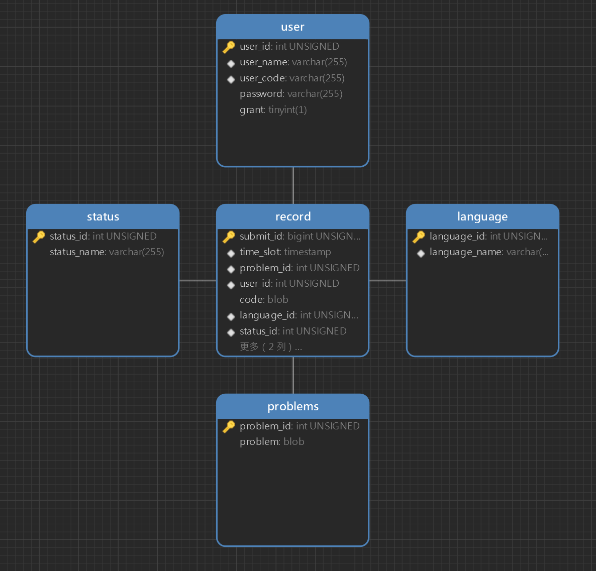

<center style= "font-size:36px; font-family:  '宋体';font-weight: bold;">在线代码提交系统</center>
<center style= "font-size:30px; font-family:  '宋体';font-weight: bold;">——数据库系统大作业</center>

## 实验人
姓名|学号|负责内容|联系方式
-|-|-|-
王子睿|21311590|前端设计和实现|18988999019
谢文龙|21311475|后端设计和实现|13016099039
## 模型概述
### 简述
- 作为本校ACM校队的学生，我们两位作者经常会需要在在线测评网站上完成一些算法竞赛题目，我们便想自己实现一个类似的但更为简化的模型，作为本次作业的主要内容。
- 本数据库系统主要实现了一个代码提交系统，其实现了作为在线代码提交系统的主要功能，即代码提交，提交记录查看等。
### 主要功能
#### 用户需求
我们按照实际需求，将用户分为普通用户和管理员用户两类，并分别实现不同需求，如下表：
-|提交代码|查看提交记录|查看代码|删除代码|修改代码状态
-|-|-|-|-|-
用户|✔|✔|仅自己|X|X
管理员用户|✔|✔|所有人|✔|✔
#### 登录页面
用户需要在登录页面输入用户名和密码，系统会自动判断用户是否被允许登录。

#### 代码提交页面
用户可以选择对应的题目和语言提交代码，提交成功后自动跳转到提交记录页面。

#### 提交记录页面
在提交记录页面，用户可以看到所有人的提交记录，也可以通过查询模式筛选指定用户名或者题目的提交记录，点击自己的提交记录会跳转到代码展示模式。

#### 代码展示
在该页面下，用户可以看到自己的代码。管理员可以查看所有代码并删除或者修改对应的提交记录。

### 主要结构设计
- 本系统主要通过html+python+mysql实现，我们通过利用python的`http.server`库来创建一个简易的服务器，串联前端和后端。
- 前端利用html+CSS+Javascript来建立一个浏览器页面（客户页面）利用HTTP GET 和HTTP POST 来传递和获得信息。
- 后端利用python的Mysqlclient库和mysql数据库来完成数据库的建构以及数据的存储和查询。

## 前端部分
- 由于完整代码过长（每个html文件 300行以上），这里就不放代码了。所有代码会放在附件中，也可以到我们的github仓库查看。
- [在线代码提交系统](https://github.com/VMalzahar/database-homework-T8)

### 登录页面
#### 流程图

#### 页面展示


### 代码提交页面
#### 流程图

#### 页面展示


### 提交记录页面
#### 流程图

#### 页面展示


### 代码展示页面
#### 流程图

#### 页面展示


### python部分
#### 流程图

- 通过上面的展示我们可以知道，我们主要依靠HTTP GET和HTTP POST中的不同路径来处理不同的请求，python部分就是负责这将不同路径调用相应封装好的功能函数，起到控制的作用。
  
```python
    def do_GET(self): #处理HTTP GET请求，不同路径对应不同的处理
        
        global username,state,dbconn
        path = self.path
        if(path=='/'):
            if(username!=''):
                self.path='/status.html'
        if(path=="/login.html"):
            username=""
        if(path=="/user"):
            self.send_response(200)
            self.send_header("Content-type","text/html")
            self.send_header("username",username)
            self.end_headers()
            return
        if(path=="/submissions"):
            self.send_response(200)
            self.send_header("Content-type","text/json")
            self.end_headers()
            data=get_status(dbconn)
            data=json.dumps(data)
            self.wfile.write(bytes(data, 'utf-8'))
            return

        print(path)
        self.writef()
```
- HTTP POST 的处理是类似的，不过值得主意的是他通过这样的方式获得javascript的字符串：
```python
    datas = self.rfile.read(int(self.headers['content-length']))    #固定格式，获取表单提交的数据
    datas= json.loads(datas)
```
## 数据库设计


对于记录`record`其包含自身id，提交时间戳，题目id，用户id，代码语言id，提交状态id，具体代码，代码长度，代码测试用时信息。

- 使用外键约束。
- 对记录的过滤功能的支持中，过滤要求基本没有对某一列进行范围获取的要求，而常常是直接对特定的内容匹配，故基本使用哈希索引。
- 考虑到同一时间内登陆的管理员仅有一位，而用户之间的操作互不影响，故不考虑互斥。

## 功能设计和开发
### 后端核心功能及未启用功能
后端实现了功能较为丰富的查询筛选功能，而实际被应用的功能为对单个题目及单个用户作筛选的查询功能。

```python
# 按要求选择提交记录，返回成功与否
# 传入参数为空，则表示不做限制
def select_record(self,
        submit_ids:list[int] = [],
        user_ids:list[int] = [],
        status_ids:list[int] = [],
        problem_ids:list[int] = [],
        language_ids:list[int] = []
        )->bool:
    pass
```

后端支持多记录修改与删除，而实际被应用的功能为删除单条记录及修改一条记录的提交状态信息。

```python
def update(self,
          update_column:str,
          update_record:list[(any,int)])->bool:
    pass
def delete(self,submit_ids:list[int])->bool:
    pass
```

后端支持提交代码后返回提交得到的 `submit_id`
```python
def submit(self,problem_id:int,lang_id:int,code:str)->int:
    pass
```

### 选取记录部分
#### 视图暂存
对于OJ来说记录数据规模会较大，且用户一般会进行连续浏览。
采用视图暂存查询信息。

以用户id及姓名作为查询视图的标识。

```sql
CREATE OR REPLACE VIEW [标识] AS
SELECT * FROM record NATURAL JOIN `user`
WHERE [[TRUE / 列 in (过滤内容)] AND [] AND ...]
ORDER BY time_slot DESC, submit_id DESC
```

#### 部分浏览
用户对信息的查询从视图中获取。

由于使用网页显示，网页显示内容有限，故可使用 `LIMIT` 取部分记录。

```sql
SELECT * FROM [标识] LIMIT [x,num]
```

### 数据库对接
#### 防止注入攻击
oj 、博客等文本应用中用户的文本内容多样，还可能出现sql代码在其中，若直接使用字符串录入数据，则容易录入失败甚至被用户注入攻击。

例如使用 sql 录入数据库时，会使用
```sql
INSERT INTO `record`(`code`) VALUES ('%s')
```

`%s` 取用户输入内容，若输入内容为

```sql
');\nDELETE FROM `record`;\nINSERT INTO `record`(`code`) VALUES ('
```

则最终到数据库中实际运行的内容会变成如下内容，其会构成对数据库的攻击

```sql
INSERT INTO `record`(`code`) VALUES ('');
DELETE FROM `record`; -- 此处进行攻击
INSERT INTO `record`(`code`) VALUES ('');
```

考虑 sql 使用 BLOB 结构存储，通过字符串转换为 16 进制的方式录入数据。
- python$\to$sql: `"0x"+code.encode("utf-8").hex()`
- sql$\to$python: `code.decode("utf-8")`

#### 触发器
通过默认值方式在插入记录时增加时间戳。
```sql
`time_slot` timestamp NULL DEFAULT CURRENT_TIMESTAMP
```

通过触发器方式在插入记录时测量代码长度作为默认值。
```sql
CREATE TRIGGER `insert` BEFORE INSERT ON `record` FOR EACH ROW
SET NEW.code_len=LENGTH(NEW.`code`)
```

## 数据库创建和数据加载
使用 `data_base_build.sql` 建立 mysql 数据库。

需要有一个管理员登录数据库操作数据库，在中间层处理用户相关数据。

除了代码的提交外，其它的内容仅支持到数据库直接添加。

## 感想总结
**谢文龙：** 数据库在应用中发挥着数据存取的重大作用，想要应用数据库实现相应功能并不困难，而加速及保护数据的存取是体现程序员实际水平的所在。此项目的实现是宝贵的开发经验，同时仍有许多可以改进的地方。

**王子睿：** 本次数据库实验算是给我了一个从零到一的前端开发经验，整个html的设计包括CSS和Javascript的学习都让我收获颇多。这次数据库实验或许是我第一次完整开发一个项目的宝贵经验。

## 项目网址
https://github.com/VMalzahar/database-homework-T8